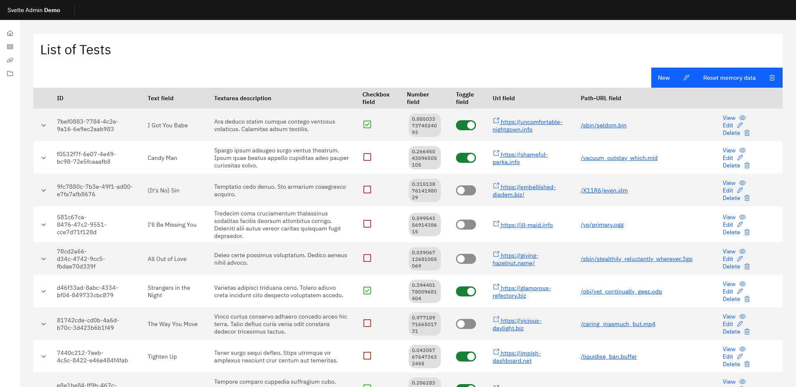
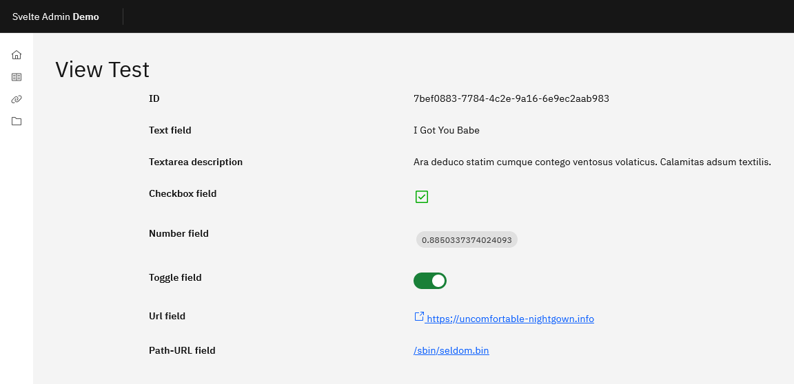
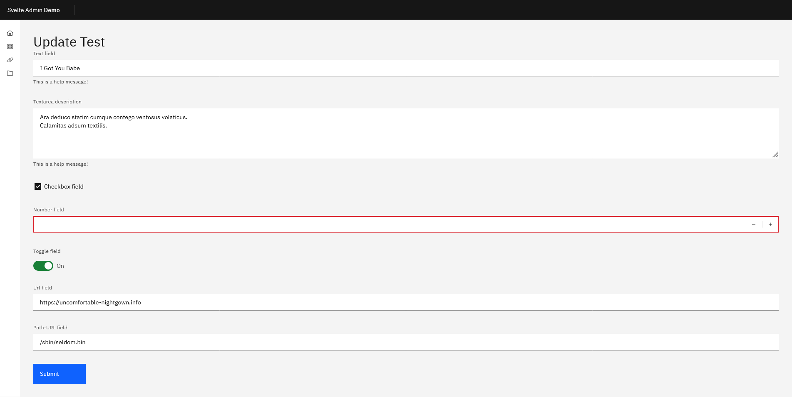

# Svelte admin

This package is an **admin generator** for your JS/TS/Svelte projects. It can consume a distant API, a localStorage, or even an RPC-based data storage (like when using [Tauri](https://tauri.app/)).

| List                                                       | View                                                       | Edit                                                       |
| ---------------------------------------------------------- | ---------------------------------------------------------- | ---------------------------------------------------------- |
|  |  |  |

There is a [roadmap](#roadmap) at the end of this documentation to know what features are soon coming!

## Installation

You can install SvelteAdmin with one of these commands, depending on your package manager:

```bash
yarn add "@orbitale/svelte-admin"

npm install --save "@orbitale/svelte-admin"
```

If you want to use the latest version committed to Github, you can run one of these commands to add it to your project:

```bash
yarn add "@orbitale/svelte-admin@git://github.com/Orbitale/SvelteAdmin.git"

npm install --save "@orbitale/svelte-admin@git://github.com/Orbitale/SvelteAdmin.git"
```

This comes with no warranty of working perfectly (again, it's a prototype).

## Usage

An administration panel is composed of three main components:

1. The `Dashboard` definition: it provides some metadata, the links you will add to your menus.
2. The `Crud` definition**s**: added to your Dashboard, they define the resource type you will manipulate in each operation of your Crud. All Cruds also define how to fetch and persist your data from whatever data source you want (usually it might be some kind of API).
3. The Svelte route that will **render** the Dashboard, based on your sole `Dashboard` definition, and called by user input (like URL parameters).

Usually, you will have **one dashboard** and set **one Crud per entity** to your administration panel.

### Create a Dashboard

First, create a classic [SvelteKit project](https://kit.svelte.dev/), as an empty application, and when prompted whether to use Typescript, say **yes** (we highly recommend using Typescript).

#### The Dashboard config

Then, create a `src/lib/Dashboard.ts` file, and start writing the necessary data to create a Dasbhoard object:

```typescript
// src/lib/Dashboard.ts

// Some fancy icons for a neat UI:
import Book from 'carbon-icons-svelte/lib/Book.svelte';
import Home from 'carbon-icons-svelte/lib/Home.svelte';

// SvelteAdmin classes:
import { DashboardDefinition, UrlAction } from '@orbitale/svelte-admin';

// See later:
import booksCrud from './booksCrud';

// The dashboard setup:
export const dashboard = new DashboardDefinition({
	// Some metadata related to your admin panel
	admin: {
		defaultLocale: 'en',
		rootUrl: '/admin',
		head: {
			brandName: '{ Your company/brand name }',
			appName: '{ Your app name }'
		}
	},

	// The main menu on the left side of the page
	sideMenu: [
		new UrlAction('Homepage', '/', Home),
		new UrlAction('Book', '/admin/books/list', Book)
	],

	// Here you set all the Crud configurations of your admin panel
	// For organization purposes, we recommend you to define your Crud configs
	//   in separate typescript files, it makes it easier to read and maintain.
	cruds: [booksCrud]
});
```

#### The Crud config

Then, create the `src/lib/booksCrud.ts` file, it will contain your "Books" Crud configuration:

```typescript
// src/lib/booksCrud.ts

// Again, some icons to pop your admin!
import Pen from 'carbon-icons-svelte/lib/Pen.svelte';
import TrashCan from 'carbon-icons-svelte/lib/TrashCan.svelte';

// SvelteAdmin classes:
import {
	TextField,
	TextareaField,
	UrlAction,
	List,
	Edit,
	Delete,
	CallbackStateProcessor,
	CallbackStateProvider
} from '@orbitale/svelte-admin';

// These are the most common fields you want for your "Book" entity:
const fields = [
	new TextField('title', 'Title', { placeholder: "Enter the book's title" }),
	new TextareaField('description', 'description', {
		placeholder: "Enter the book's descrption",
		help: "Please don't make a summary of the book, remember to not spoil your readers!"
	})
];
// Note: these fields can of course change based on different pages/actions,
//   so feel free to spread this out if you have more complex admins!

// Finally: the actual Crud object!
export const booksCrud = new CrudDefinition(
	// This is a unique name that will serve as identifier for the Crud:
	'books',

	{
		// These labels are used to display titles or operation messages,
		// If you add them to your own translation dictionary, they can be translated too!
		// (see more about translations below)
		label: { singular: 'Book', plural: 'Books' },

		// The "operations" are the actual Crud pages you will use.
		// SvelteAdmin has some generic ones for you, but you can also create your own!
		operations: [
			// Basic data grid listing all your Books.
			// Will display "edit" and "delete" buttons on the right of the list.
			new List(fields, [
				new UrlAction('Edit', '/admin/books/edit', Pen),
				new UrlAction('Delete', '/admin/books/delete', TrashCan)
			]),

			// Straightforward "edit" form, can be accessed via the "edit" link above.
			new Edit(fields, []),

			// Deletion page with confirmation message and buttons,
			// accessed via the "delete" link configured above
			new Delete(fields, new UrlAction('List', '/admin/books/list', null))
		],

		// See below about state processors and providers.
		stateProvider: new CallbackStateProvider(function (operation, requestParameters = {}) {
			console.info('TODO: return actual data, like from an API');

			return Promise.resolve(null);
		}),

		// See below about state processors and providers.
		stateProcessor: new CallbackStateProcessor(function (data, operation, requestParameters = {}) {
			console.info('TODO: process new, edit or delete data based on the current operation');

			return Promise.resolve();
		})
	}
);
```

Voilà!

Well, your Crud is not totally ready, because it needs two more actions: being rendered, and fetching the **real** data.

About the "fetching" part, we will leave this for below chapters.

However, let's render our dashboard!

#### Rendering the dashboard

If you have a common SvelteKit project, you can directly create a new route page for your base admin.

Since we will mostly use the URL to determine what Crud and operations we are looking at, let's use SvelteKit's router to make our URLs shine with as less code as possible!

Create a `src/routes/admin/[crud]/[operation]/+page.svelte` file with the following code:

```html
<script lang="ts">
	// src/routes/admin/[crud]/[operation]/+page.svelte

	// This is a custom Svelte store created by SvelteKit,
	//   it points to an instance of a Page object,
	//   which can allow us to gather data from the current page,
	//   such as the window.URL object, or the dynamic parameters of your route.
	// More details about the "page" store there:
	//   https://kit.svelte.dev/docs/modules#$app-stores-page
	import { page } from '$app/stores';

	// Same here as the previous "page" store, but the "browser" var contains
	//   a boolean that is set to "false" during server-side rendering, and to
	//   "true" when the Svelte component is mounted to the DOM.
	import { browser } from '$app/environment';

	// This function helps retrieving the [crud] and [operation] variables from the URL,
	// as well as the potential query string params like "?id=..."
	import { getRequestParams } from '@orbitale/svelte-admin';

	// That's your custom dashboard!
	// The "$lib" alias is configured by SvelteKit,
	//   it always points to your "src/lib/" directory.
	import { dashboard } from '$lib/Dashboard';

	// The "$:" syntax is valid Javascript code that tells Svelte
	//   that the following code is reactive, based on the values it depends on.
	// On this code, reactivity depends on "page" and "browser" variables.
	$: crud = $page.params.crud;
	$: operation = $page.params.operation;
	$: requestParameters = getRequestParams($page, browser);
	// Note: prefixing "page" with "$" makes sure we refer to the store's actual value.
	// If we didn't add this "$" prefix, we would use an object containing a method ".subscribe()", but we can use it to execude code whenever the store data changes. The "$" prefix sort of shortens everything for us automatically.
</script>

<!--
The "key" block makes sure its content is re-rendered whenever its arguments change.
Then, if the "$page" changes, the <svelte:component> component is re-rendered,
which is exactly what we expect when the current web page actually changes!
-->
{#key $page}
<svelte:component
	this="{dashboard.adminConfig.theme.dashboard}"
	{dashboard}
	{crud}
	{operation}
	{requestParameters}
/>
{/key}
```

That's it!

Now, your admin is prepared.

Here is the \*_shorter version_ with no comments, if you want to copy-paste for a quick setup:

```html
<script lang="ts">
	import { page } from '$app/stores';
	import { browser } from '$app/environment';
	import { getRequestParams } from '@orbitale/svelte-admin';

	import { dashboard } from '$lib/Dashboard';

	$: crud = $page.params.crud;
	$: operation = $page.params.operation;
	$: requestParameters = getRequestParams($page, browser);
</script>

{#key $page}
<svelte:component
	this="{dashboard.adminConfig.theme.dashboard}"
	{dashboard}
	{crud}
	{operation}
	{requestParameters}
/>
{/key}
```

#### Fetching your data with State providers

As we have seen before, there are two entrypoints to your data source, one of them is the **state provider**, and there is one per Crud.

A SateProvider is a class that implements this interface:

```typescript
export interface StateProvider<T> {
	provide(action: CrudOperation, requestParameters: RequestParameters): StateProviderResult<T>;
}
```

- The `operation` object is the same as one of the Crud operations, the ones you configure in your `CrudDefinition` objects.<br>It allows you to return different data in the `List` and ̀`Edit` operations, with an `if` statement to discriminate both.
- The `requestParameters` is a key=>value object, matching this typescript type: `{[key: string]: string}`.<br>As you have seen above in the default Svelte template we wrote, these come from both the QueryString and the Route Params.<br>It will therefore contain the `[crud]` and `[operation]` parameters extracted from the URL, but also the entity ID if you add it via `?id=...` for example.

The return type `StateProviderResult<T>` resolves to `Promise<T | PaginatedResults<T> | Array<T> | null>`, so you could return almost anything that represents an entity, or a list of entities.<br>
It **must** though be a `Promise` object.<br>
If your code is synchronous, you can use the `Promise.resolve(your_value)` method in order to return a _"semi-synchronous"_ promise.

The only implemented provider so far is the `CallbackStateProvider`, with which you define an external callback function that returns whatever you want.

#### Storing your data with State processors

The second entrypoint to your data source is the **state processor**, and as for the state provider, there is only one processor per Crud.

A StateProcessor is a class that implements this interface:

```typescript
export interface StateProcessor<T> {
	process(
		data: StateProcessorInput<T>,
		operation: CrudOperation,
		requestParameters: RequestParameters
	): void;
}
```

The `StateProcessorInput<T>` type resolves to `T | Array<T> | null`, similarly to `StateProviderResult` you have seen in the previous section. This way, it can resolve to most of your entity types.

Very useful to send HTTP requests to your API to save data!

The only implemented provider so far is the `CallbackStateProcessor`, it allows you to define an external callback function that does whatever you want.

#### Translations

SvelteAdmin is translated, by using the [svelte-i18n](https://github.com/kaisermann/svelte-i18n) package.

Most **labels** you will provide to your dashboard (fields labels, Crud operations labels, etc.) will be translated with svelte-i18n, whether or not they have an associated translation.<br>
Fallback will be to the `en` locale anyway.

If you want **your own translations**, or if you need to **override** existing translations, you can provide your own translation dictionaries to SvelteAdmin.

To do so, provide the `localeDictionaries` option to your `DashboardDefinition` creation:

```typescript
export const dashboard = new DashboardDefinition({
	// ...
	localeDictionaries: {
		en: {
			my_text: 'My Translation'
		}
	}
});
```

This dictionary will **append non-existing, and override existing** translations. If the translation key exists in SvelteAdmin, your custom translations will override it.

To avoid having a big dashboard definition file, you can put your translations in an external file.

For the rest of translations, you can still use the same dictionary for a local `svelte-i18n`-based setup in your own application.

## Roadmap

This project is still incomplete, and if you want to contribute, feel free to submit an [issue](https://github.com/Orbitale/SvelteAdmin/issues/new) or a [pull-request](https://github.com/Orbitale/SvelteAdmin/compare)!

In the meantime, here is the roadmap for future features:

- Add more filters to the built-in ones (like number, date, etc.).
- Add support for validation in CrudForm (therefore `Edit` and `New` operations).
- Add other themes than Carbon, which is the default for now. **Note:** There is a [pending pullrequest](https://github.com/Orbitale/SvelteAdmin/pull/2) for a Material 3 theme!
- Fix issues with NPM/Node/packaging that prevents changing theme ([#3](https://github.com/Orbitale/SvelteAdmin/issues/3))
- Add configurable `StateProvider`s and `StateProcessor`s (especially for API endpoints).

---

This project is published under the GNU-LGPL license, feel free to check the [LICENSE](./LICENSE) file for more details.
